Part 1 is focused on trying to invent digital money: we start from a quite broken idea, creating a central entity currency, and try to improve it. This part introduces the fundamental concepts behind Bitcoin: public keys, PoW, difficulty adjustments.

In part 2 we explain with more detail keys, wallets, coins, transactions, blocks, miners.

<!--more-->

The first slide is in italian, but don't be scared, the others are in english. (Horrible, I know).

The talk was recorded, and it's going to be published soon.

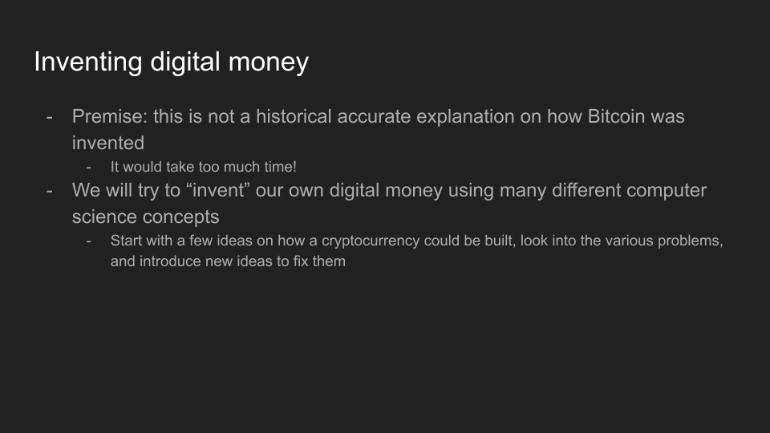

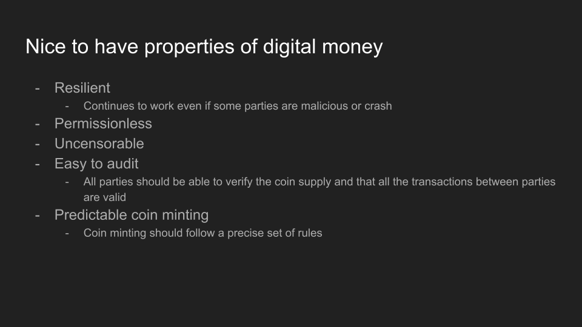
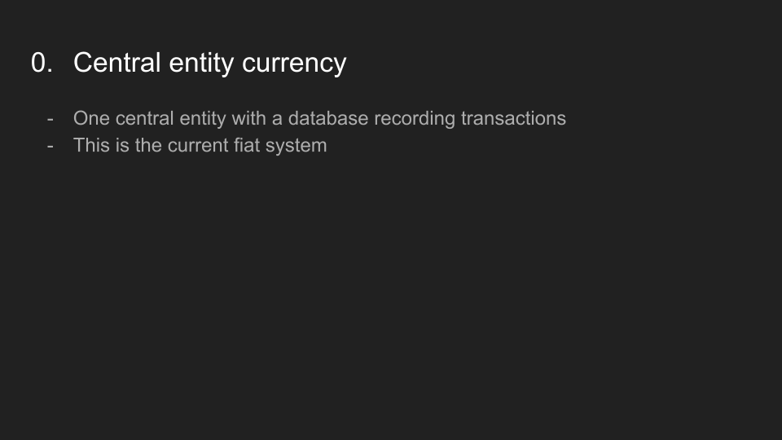
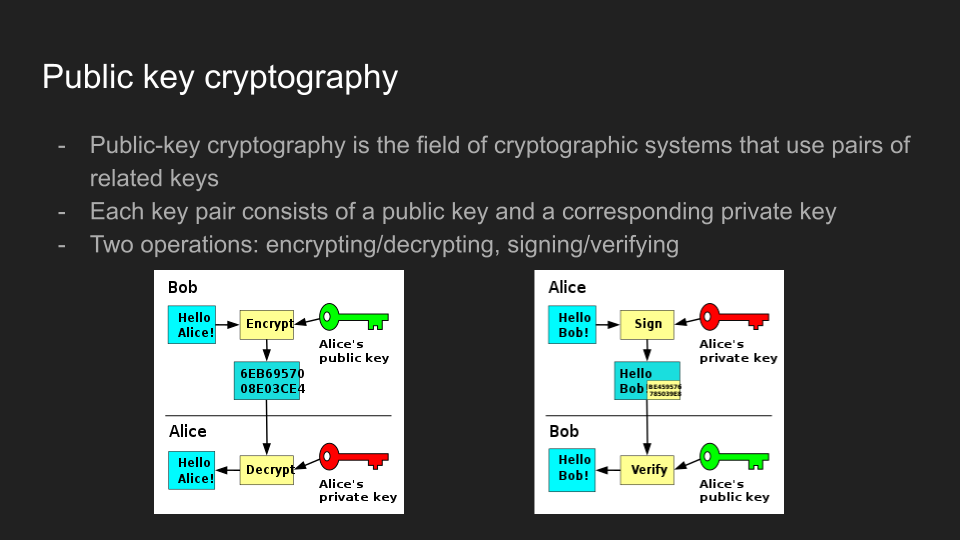

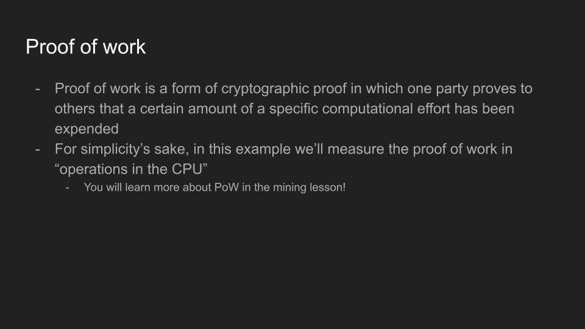

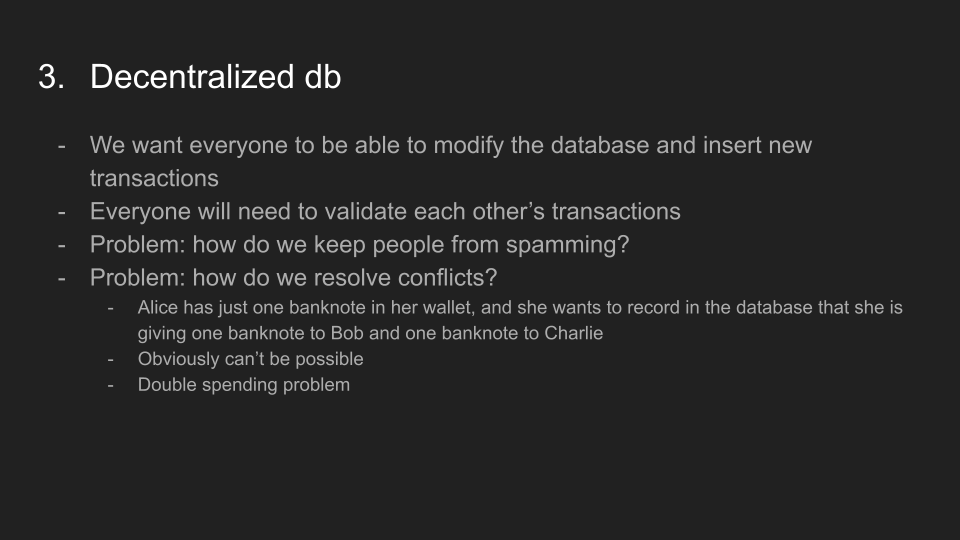
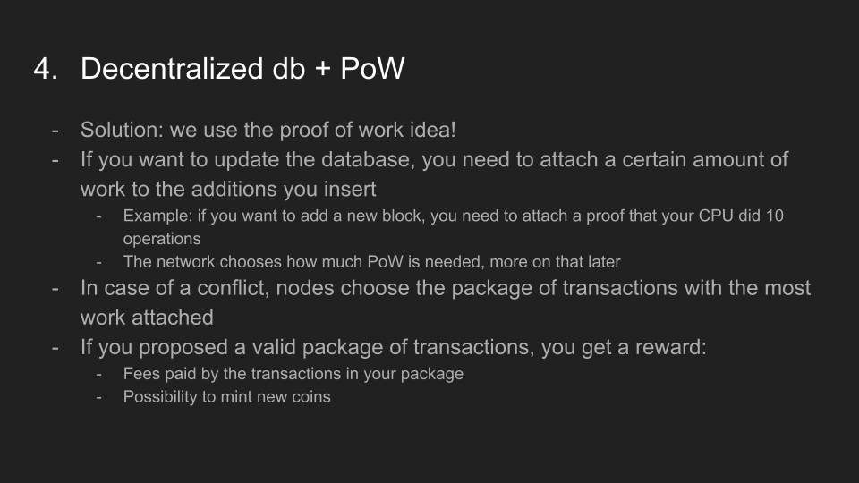
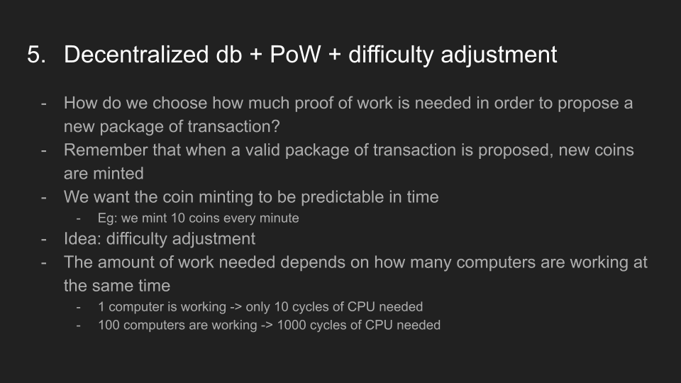

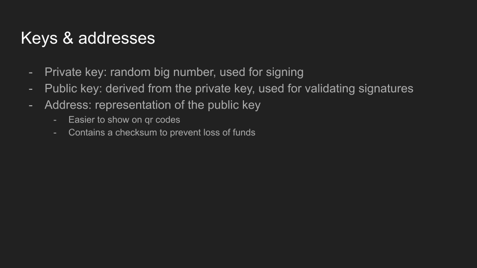

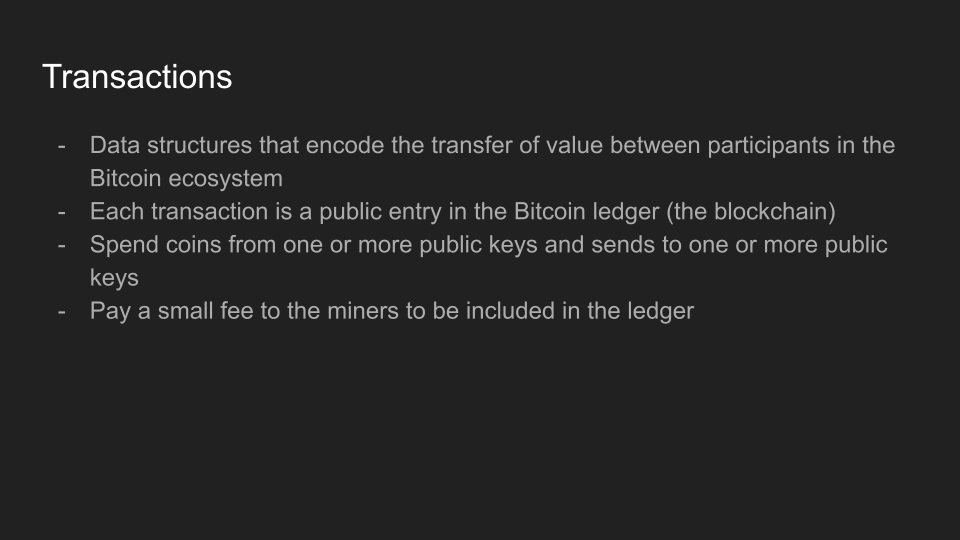
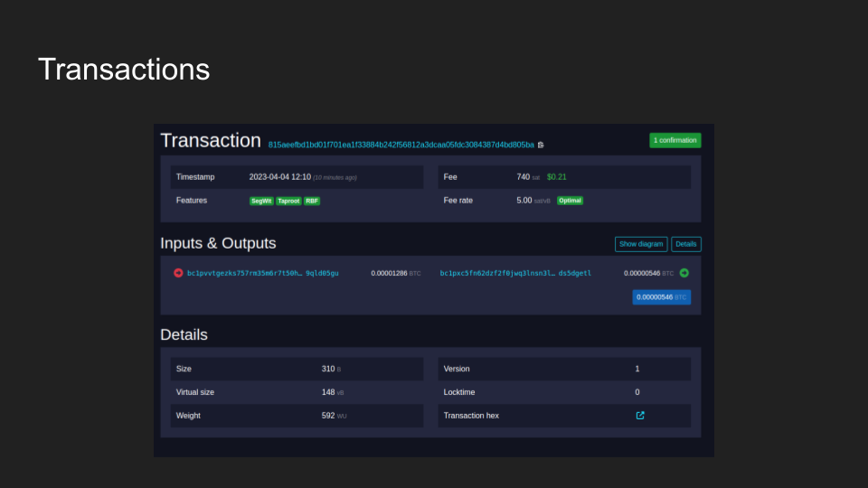

