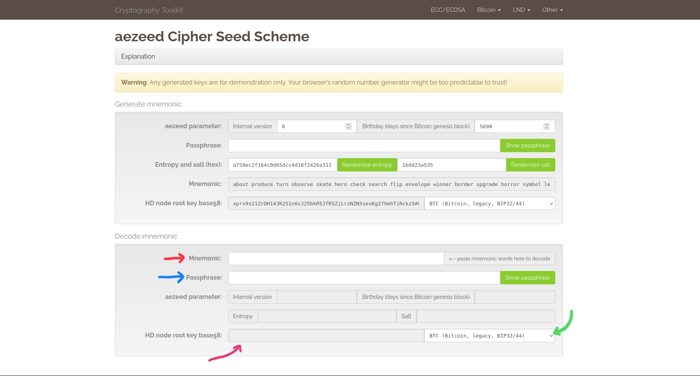
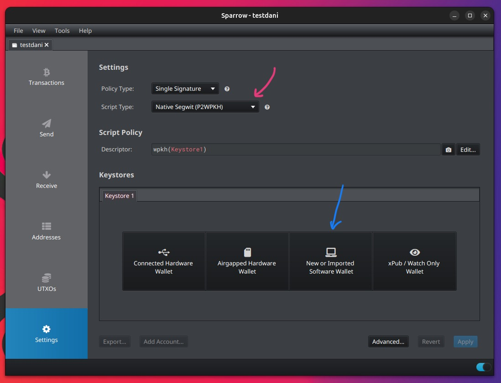
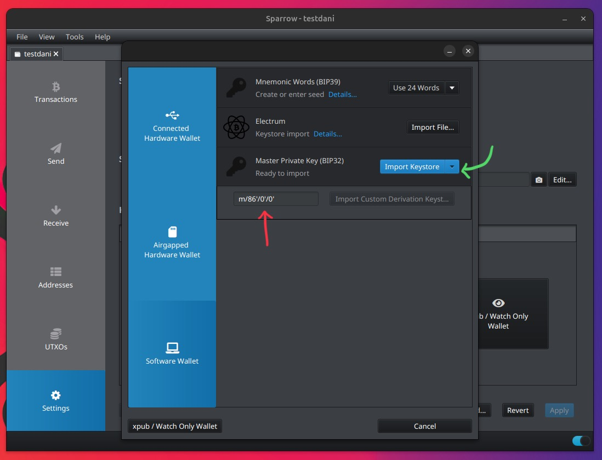
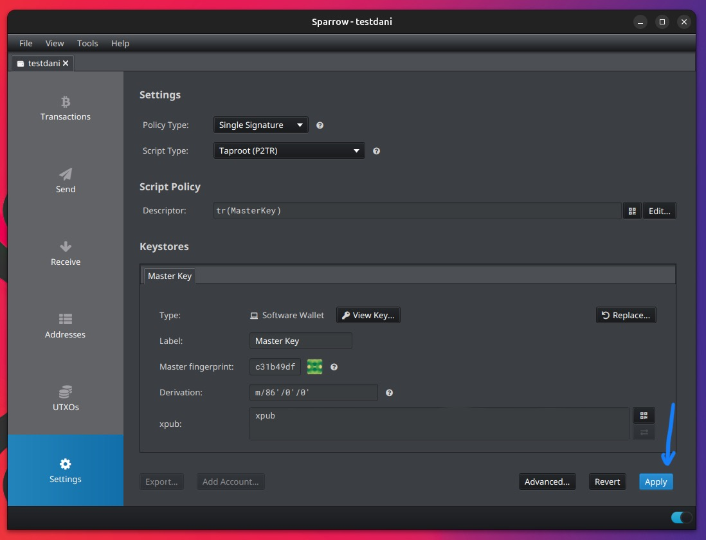

I recently had to recover some stuck funds from an onchain LND wallet. LND couldn't see the funds, and my only viable option was to re-import the seed into a different wallet and sweep everything.

LND uses Aezeed seeds, so you can't just import the seed in Sparrow or Electrum. Instead, we need to obtain the BIP32 private key and then import it into Sparrow.

Let's get started :)

# Words of caution

- Do not use an onchain wallet such as Sparrow alongside your LND node - this might cause loss of funds. Do not manipulate or interact with Lightning transactions via an onchain wallet, unless you absolutely know what you're doing.
- Importing your LND seed into an onchain wallet is a last resort solution, to be used only if you have onchain funds that you are unable to see or spend from LND.

# Step 0: Identify your LND wallet

LND uses three types of wallets:

- BIP49 (`HYBRID_NESTED_WITNESS_PUBKEY_HASH`)
- BIP84 (`WITNESS_PUBKEY_HASH`)
- BIP86 (`TAPROOT_PUBKEY`)

You can see the wallets' addresses and their balances by running:

```
lnci wallet addresses list
```

The result will look like this:

```
{
    "account_with_addresses":  [
        {
            "name":  "default",
            "address_type":  "HYBRID_NESTED_WITNESS_PUBKEY_HASH",
            "derivation_path":  "m/49'/0'/0'",
            "addresses":  [
                *addresses and info here*
            ]
        },
        {
            "name":  "default",
            "address_type":  "WITNESS_PUBKEY_HASH",
            "derivation_path":  "m/84'/0'/0'",
            "addresses":  [
                *addresses and info here*
            ]
        },
        {
            "name":  "default",
            "address_type":  "TAPROOT_PUBKEY",
            "derivation_path":  "m/86'/0'/0'",
            "addresses":  [
                *addresses and info here*
            ]
        }
    ]
}
```

Identify the wallet that you want to import into Sparrow, then note the derivation path and the first address - this will be useful for verification later. If your wallet is `HYBRID_NESTED_WITNESS_PUBKEY_HASH` or `WITNESS_PUBKEY_HASH`, you can also import it into Electrum, as detailed [here](https://www.lightningnode.info/technicals/restorelndonchainfundsinelectrum). For `TAPROOT_PUBKEY` wallets, Sparrow is currently the only viable option.

# Step 1: Retrieve LND seed and passphrase

Find your 24-word seed phrase, and any optional passphrase you may have used.
Make sure not to confuse your seed passphrase with your wallet password - refer to the [LND recovery documentation](https://github.com/lightningnetwork/lnd/blob/master/docs/recovery.md#wallet-and-seed-passphrases) for more details.

# Step 2: Convert Aezeed seed to HD Key

We will use the [Guggero Cryptography Toolkit](https://guggero.github.io/cryptography-toolkit/#!/aezeed) to convert our Aezeed seed to a HD key.

Note that pasting your seed into online tools is generally discouraged - consider using an airgapped computer, or simply downloading the webpage and using it offline.

Insert your mnemonic and passphrase in the "Decode mnemonic" section; then make sure to select "BTC (Bitcoin, legacy, BIP32/44)". You will get your xprv in the "HD node root key base58" section.



# Step 3: Import into Sparrow

Open Sparrow and create a new wallet. 

Select the Script type based on the wallet you want to import (refer to step 0):
- "Nested segwit (P2SH-P2WPKH)" for the `HYBRID_NESTED_WITNESS_PUBKEY_HASH` wallet
- "Native segwit (P2WPKH)" for the `WITNESS_PUBKEY_HASH` wallet
- "Taproot (P2TR)" for the `TAPROOT_PUBKEY` wallet

Then, click on "New or Imported Software Wallet". 



Select "Master Private Key (BIP32)" and import the key you got in Step 2.


Make sure your derivation path is the same as the one we obtained in Step 1, and Import.





# Step 4 - It's done! Yay!

Check that the first address shown by Sparrow is the same as the one we got in step 0 - if that's the case, congrats! 🎉

If the first address is different, double-check that you entered the right seed, passphrase, derivation path, script type.
